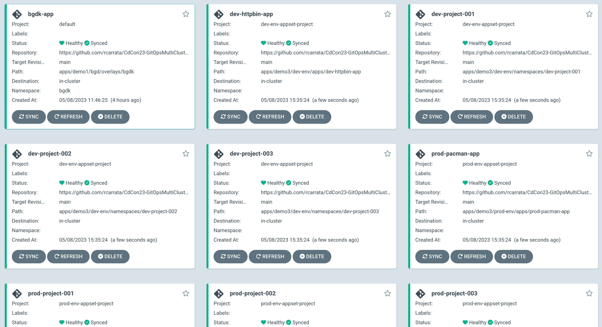

# cdCon and GitOpsCon 2023 - Managing GitOps deployments in multi-cluster production environments

Repository for the [cdCon & GitOpsCon 2023](https://events.linuxfoundation.org/cdcon-gitopscon/) about Managing GitOps deployments in multi-cluster production environments.

## Abstract

During [this session](https://sched.co/1LAFy) we will demonstrate how to manage and scale productive ArgoCD deployments in a multi cluster environment easily and securely using GitOps patterns.

We will present the deployment of applications across multiple Kubernetes clusters on various public and private clouds and explore the best practices for scaling and managing highly available, reliable and secure applications. We will also demonstrate how you can structure your Git repositories to share and scale within your teams and organization in order to deploy your cloud native deployments in an automatic and predictive way.

After this technical session you will know more about the challenges and the benefits of using GitOps patterns to scale your productive applications in multi cluster scenarios and in a Cloud agnostic way.

## Demos

* [Demo 1 - GitOps Application with Kustomize](./demos/demo1/README.md)
* [Demo 2 - Deploying GitOps Apps in Remote Clusters](./demos/demo2/README.md)
* [Demo 3 - Managing GitOps Apps at scale](./demos/demo3/README.md)
* [Demo 4 - GitOps Multi-Cluster Deployment Strategies](./demos/demo4/README.md)
* [Demo 5 - GitOps Multi Cluster & Multi-Environment Strategies](./demos/demo5/README.md)
* [Demo 6 - Promotion between GitOps environments](./demos/demo6/README.md)

## Slides

* [Slides - CdCon & GitOpsCon - Managing GitOps deployments in multi-cluster production environments](./docs/slides.pdf)

## Audience

For anyone interested in DevOps, SRE, application platform management, and anyone who manages complex Kubernetes environments at scale.

After this session, DevSecOps teams, SREs, Kubernetes sysadmins, will learn about the best practices and strategies to deploy complex and advanced deployments using GitOps.

## Contributors / Maintainers

* [Roberto Carratalá](github.com/rcarrata)
