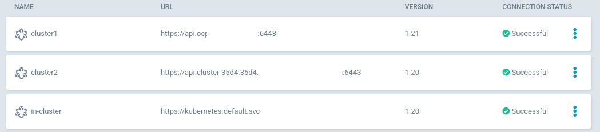
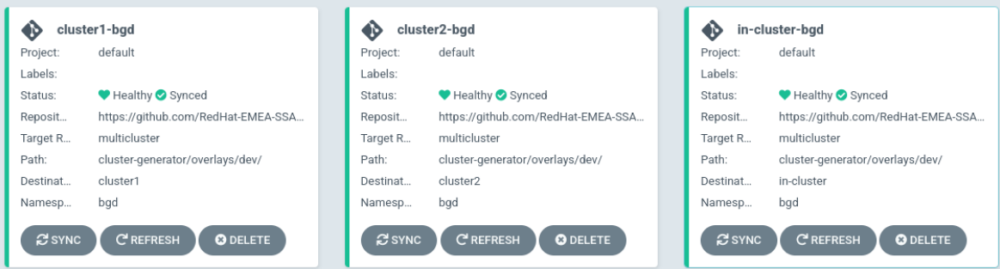

# Demo 4 - GitOps Cluster Deployment Strategies

## Add new Managed clusters into ArgoCD

* Follow the [Managed Clusters into ArgoCD guide](../bootstrap/multicluster.md)

NOTE: if you did this step in the demo2, skip the previous guide.

* Check the existing ArgoCD Managed clusters available:

```
argocd cluster list
SERVER                                                     NAME        VERSION  STATUS      MESSAGE
https://api.cluster-35d4.35d4.xxxx.opentlc.com:6443  cluster2    1.20     Successful
https://api.k8s.xxxx.com:6443                         cluster1    1.21     Successful
https://kubernetes.default.svc                             in-cluster  1.20     Successful
```



* https://argoproj.github.io/argo-cd/operator-manual/declarative-setup/#clusters

## Deploy Applications in Multi Cluster Environment

```
cd ~/CdCon23-GitOpsMultiCluster/demos/demo4/
kubectl apply -k deploy
```



## Application Sets with Multi Clustering Environments

In Argo CD, managed clusters are stored within Secrets in the Argo CD namespace. The ApplicationSet
controller uses those same Secrets to generate parameters to identify and target available clusters.

For each cluster registered with Argo CD, the Cluster generator produces parameters based on the
list of items found within the cluster secret.

* [ApplicationSets documentation site](https://argocd-applicationset.readthedocs.io/en/stable/)

* [Generator Cluster Documentation](https://argocd-applicationset.readthedocs.io/en/stable/Generators-Cluster/)

## Delete ApplicationSet for Apps

For delete the multicluster environment:

```
kubectl delete applicationset -n argo welcome-app-appset
```

## Links of interest

* [Getting Started with Application Sets](https://cloud.redhat.com/blog/getting-started-with-applicationsets)
* [GitOps Guide to the Galaxy (Ep 15): Introducing the App of Apps and ApplicationSets](https://www.youtube.com/watch?v=HqzUIJMYnfY&ab_channel=OpenShift)
