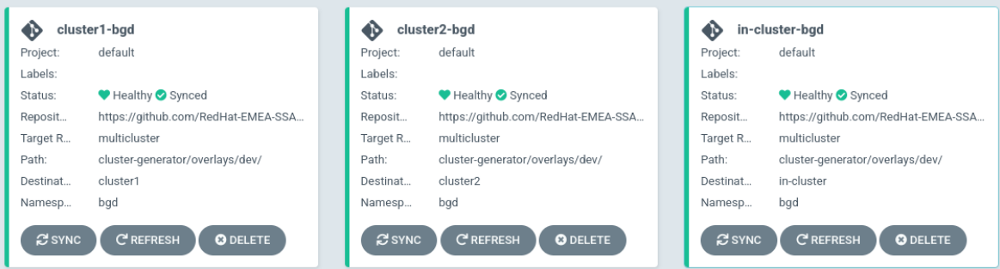

# Pattern 5 Demo - GitOps Cluster Deployment Strategies

## Login in ArgoCD Server with argocd cli

* Login with the admin user with the argocd cli

```
curl -sSL -o /usr/local/bin/argocd https://github.com/argoproj/argo-cd/releases/latest/download/argocd-linux-amd64
chmod +x /usr/local/bin/argocd

ARGOPASS=$(kubectl --namespace argocd get secret argocd-initial-admin-secret -o json | jq -r '.data.password' | base64 -d)

argocd login $ARGOCD_URL --grpc-web --username=admin --password=$ARGOPASS
```

## Configuring the multi-clustering in ArgoCD

* Login to the cluster1 and set up a kubeconfig for change the context rapidly:

```
touch /var/tmp/lab-kubeconfig
export KUBECONFIG=/var/tmp/lab-kubeconfig

kubectl login --insecure-skip-tls-verify=true --username=<admin_user> --password=<admin_password> https://api.<hub_cluster_name>.<base_domain>:6443

kubectl config rename-context $(kubectl config current-context) cluster1
```

* Login to the cluster2 and configure them into the kubeconfig:

```
kubectl login --insecure-skip-tls-verify=true --username=<admin_user> --password=<admin_password> https://api.<hub_cluster_name>.<base_domain>:6443

kubectl config rename-context $(kubectl config current-context) cluster2
```

* Change between both contexts to check if it's working:

```
kubectl config use-context cluster1

kubectl config use-context cluster2
```

* Add the first cluster in the argocd server:

```
argocd cluster add cluster1
```

* Add the second cluster in the argocd server:

```
argocd cluster add cluster2
```

* Check the existing argocd clusters available:

```
argocd cluster list
SERVER                                                     NAME        VERSION  STATUS      MESSAGE
https://api.cluster-35d4.35d4.xxxx.opentlc.com:6443  cluster2    1.20     Successful
https://api.k8s.xxxx.com:6443                         cluster1    1.21     Successful
https://kubernetes.default.svc                             in-cluster  1.20     Successful
```


* https://argoproj.github.io/argo-cd/operator-manual/declarative-setup/#clusters

## Deploy Applications in Multi Cluster Environment

```
kubectl apply -k deploy
```



## Application Sets with Multi Clustering Environments

In Argo CD, managed clusters are stored within Secrets in the Argo CD namespace. The ApplicationSet
controller uses those same Secrets to generate parameters to identify and target available clusters.

For each cluster registered with Argo CD, the Cluster generator produces parameters based on the
list of items found within the cluster secret.

* [ApplicationSets documentation site](https://argocd-applicationset.readthedocs.io/en/stable/)

* [Generator Cluster Documentation](https://argocd-applicationset.readthedocs.io/en/stable/Generators-Cluster/)

## Delete ApplicationSet for Apps

For delete the multicluster environment:

```
kubectl delete applicationset -n argo welcome-app-appset
```

## Links of interest

* [Getting Started with Application Sets](https://cloud.redhat.com/blog/getting-started-with-applicationsets)
* [GitOps Guide to the Galaxy (Ep 15): Introducing the App of Apps and ApplicationSets](https://www.youtube.com/watch?v=HqzUIJMYnfY&ab_channel=OpenShift)
